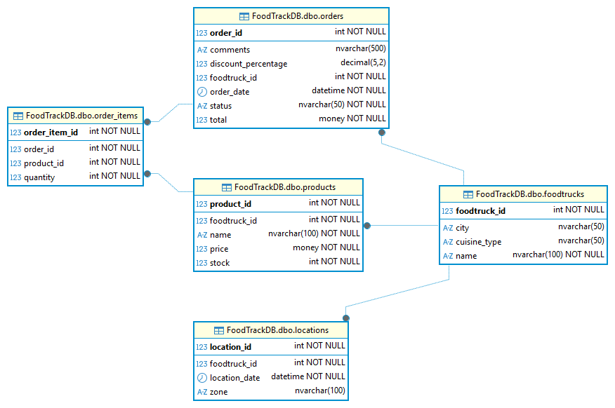

# FoodTrack Database Project


FoodTrack es una base de datos diseñada para gestionar operaciones de **foodtrucks** en distintas ciudades.  

Incluye:
- modelado de datos
- implementación en SQL Server
- inserción de datos
- automatización en Python
- versionado con Git y GitHub

---

## Estructura del repositorio

```bash
foodtrack-db/
│
├─ scripts/
│   ├─ 01_create_tables.sql
│   ├─ 02_insert_foodtrucks.sql
│   ├─ 03_insert_products.sql
│   ├─ 04_insert_orders.sql
│   ├─ 05_insert_order_items.sql
│   ├─ 06_insert_locations.sql
│   ├─ 07_Esquema_DDL_Foodtrack.sql
│   ├─ 08_Script_DML_de_Insercion.sql
│   ├─ 09_Consultas_DQL.sql
│   ├─ 10_ALTER_Comments.sql
│   └─ 11_ALTER_discount.sql
│
├─ data/
│   ├─ 01-foodtrucks.csv
│   ├─ 02-products.csv
│   ├─ 03-orders.csv
│   ├─ 04-order_items.csv
│   └─ 05-locations.csv
│
├─ AUT_failed_orders.py
├─ FoodTrackDB_ER.png
└─ README.md
```

---

## Diagrama ER



> Exportado desde DBeaver.

---

## Cómo ejecutar este proyecto
### Formato árbol
```bash
│
1. Crear base de datos
│   └─ CREATE DATABASE FoodTrackDB; GO
│
2. Crear tablas
│   └─ scripts/01_create_tables.sql
│
3. Insertar datos iniciales
│   ├─ scripts/02_insert_foodtrucks.sql
│   ├─ scripts/03_insert_products.sql
│   ├─ scripts/04_insert_orders.sql
│   ├─ scripts/05_insert_order_items.sql
│   └─ scripts/06_insert_locations.sql
│
4. Verificar esquema y documentación
│   └─ scripts/07_Esquema_DDL_Foodtrack.sql
│
5. Ejecutar script de automatización
│   └─ AUT_failed_orders.py
```

### Formato tabla:
| Paso | Acción                            | Archivo / Comando                      |
| ---: | --------------------------------- | -------------------------------------- |
|    1 | Crear base de datos               | `CREATE DATABASE FoodTrackDB; GO`      |
|    2 | Crear tablas                      | `scripts/01_create_tables.sql`         |
|    3 | Insertar foodtrucks               | `scripts/02_insert_foodtrucks.sql`     |
|    4 | Insertar productos                | `scripts/03_insert_products.sql`       |
|    5 | Insertar órdenes                  | `scripts/04_insert_orders.sql`         |
|    6 | Insertar items de órdenes         | `scripts/05_insert_order_items.sql`    |
|    7 | Insertar ubicaciones              | `scripts/06_insert_locations.sql`      |
|    8 | Validar estructura completa       | `scripts/07_Esquema_DDL_Foodtrack.sql` |
|    9 | Automatización opcional en Python | `AUT_failed_orders.py`                 |

---

## Scripts adicionales
| Script                         | Descripción             |
| ------------------------------ | ----------------------- |
| 07_Esquema_DDL_Foodtrack.sql   | DDL completo            |
| 08_Script_DML_de_Insercion.sql | Inserciones masivas     |
| 09_Consultas_DQL.sql           | Consultas analíticas    |
| 10_ALTER_Comments.sql          | Documentación           |
| 11_ALTER_discount.sql          | Modificación de esquema |

---

## Automatización en Python
Archivo incluido:
AUT_failed_orders.py

Funcionalidades:
-conexión via pyodbc
-carga programática de datos
-logging de errores en failed_orders

---

## Roadmap
v1.0 — COMPLETADO
✔ Modelo relacional
✔ Carga inicial de datos
✔ Scripts organizados
✔ Documentación base
✔ Automatización inicial